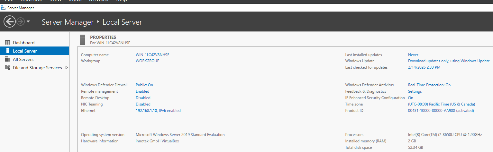
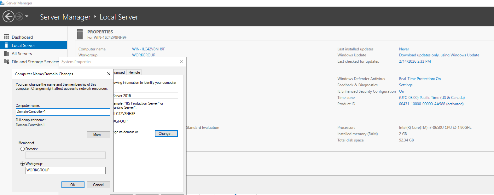

# Active Directory Domain Controller Setup (Enterprise SOC Lab)

## Overview
This document details the step-by-step setup of **Active Directory Domain Services (AD DS)** on **Windows Server 2019** to function as a **Domain Controller (DC)** in an enterprise-style SOC monitoring homelab.

Active Directory serves as the **central identity and authentication system**, enabling user, computer, and policy management while providing high-value security logs for SOC monitoring and SIEM ingestion.

---

## Lab Environment
- **Hypervisor:** VirtualBox
- **Firewall:** pfSense
- **Server OS:** Windows Server 2019
- **Client OS:** Windows Desktop (Domain-joined)
- **SIEM:** Splunk
- **Network Type:** Internal Network (LAN)

---

## Prerequisites
- Windows Server 2019 installed
- Static IP address configured
- Network connectivity to pfSense LAN
- Local Administrator access
- Virtual machine or physical server

---

 

## ⚙️ Step 1: Configure Static IP
- Clikc on **Settings**
- Open **Network & Internet**

 

- Open **Change Adapter Options**

 

- RIght click on Ethernet and click on **Properties**

- Now **Double-Click on Internet protocol Version 4**

- Click **Use the following IP address** and Assign a **static IPv4 address** in the box

**How to pick an IP Address**: 
Pick an address:
 - Inside the LAN subnet
 - Outside the DHCP range
 - Easy to remember
   **E.g:**
    - IP Address: 192.168.1.10
    - Subnet Mask: 255.255.255.0 

**Default Gateway**
 - This is always pfSense’s LAN IP.
 - Default Gateway: 192.168.1.1

**Preferred DNS**
 - Set this to the DC’s own IP address.
 - Preferred DNS: 192.168.1.10

- Set **Preferred DNS** to the server’s own IP

Note: Although some lab environments function without a static IP,
Microsoft best practice requires Domain Controllers to use a static IP
to ensure DNS and authentication reliability.
The Domain Controller is configured with a static IP address to ensure
consistent DNS resolution, authentication stability, and reliable log
correlation for SOC analysis. Client and test machines use DHCP to
simulate real-world user environments.
A static IP ensures the Domain Controller and DNS services are always reachable at a consistent address, which is required for reliable authentication and domain operations.

If your **DC’s IP changes**:
 - Log correlation becomes messy
 - Alerts may break
 - Detection rules can misfire

---

## 🏷️ Step 2: Rename the Server
- Open **Server Manager → Local Server**
- Rename the server (e.g., `DC01`)
- Restart the system

---

## 🧩 Step 3: Install Active Directory Domain Services (AD DS)

### Purpose (SOC Context)
Installing AD DS converts this server into the **central identity authority** for the lab.  
Authentication, authorization, Kerberos, and LDAP activity generated here will later be ingested into the SIEM for detection engineering and threat analysis.

### Steps
1. Open **Server Manager**
2. Click **Manage → Add Roles and Features**
3. Select:
   - **Role-based or feature-based installation**
4. Choose:
   - **Select a server from the server pool**
   - Highlight `DC01`
5. Under **Server Roles**, select:
   - ✅ **Active Directory Domain Services**
6. When prompted, click:
   - **Add Features**
7. Click **Next** through:
   - Features
   - AD DS information
8. Click **Install**

> ⚠️ Do **not** promote the server yet.

---

## 🧱 Step 4: Promote Server to Domain Controller

### Purpose
This step creates the **domain**, installs **DNS**, and enables authentication services that generate high-value SOC telemetry.

### Steps
1. In **Server Manager**, click the ⚠️ **notification flag**
2. Select:
   - **Promote this server to a domain controller**
3. Choose:
   - **Add a new forest**
4. Enter a domain name, for example: 
   - corp.local
5. Click **Next**

---

## 🔐 Step 5: Domain Controller Options

### Configuration
- **Forest functional level:** Windows Server 2016 or 2019
- **Domain functional level:** Windows Server 2016 or 2019
- ✅ **Domain Name System (DNS)**
- Global Catalog: Enabled by default
- Set a **Directory Services Restore Mode (DSRM) password**

> 🔒 SOC Note:  
> DSRM credentials are sensitive and abused in recovery and persistence scenarios. Store securely.

---

## 🌐 Step 6: DNS Configuration

- Ignore the **DNS delegation warning**
- This is expected in isolated or lab environments
- Click **Next**

The Domain Controller will now act as:
- DNS server
- Authentication authority
- Directory services host

---

## 🧾 Step 7: NetBIOS Name

- Accept the default NetBIOS name (e.g., `CORP`)
- Click **Next**

---

## 📂 Step 8: AD Database Paths

Leave defaults unless simulating advanced enterprise storage layouts.

- NTDS database
- Logs
- SYSVOL

Defaults are appropriate for SOC labs.

Click **Next**.

---

## ✅ Step 9: Review & Install

1. Review configuration summary
2. Verify **Prerequisites Check** passes
3. Click **Install**
4. Server will automatically reboot

---

