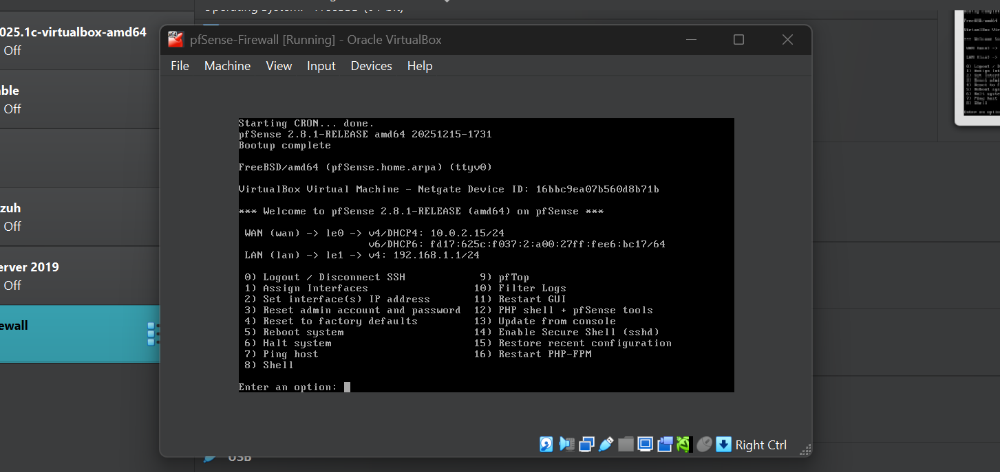
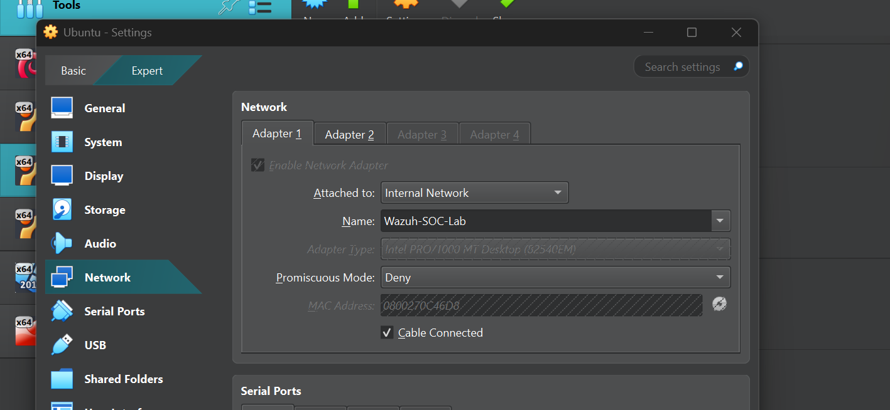
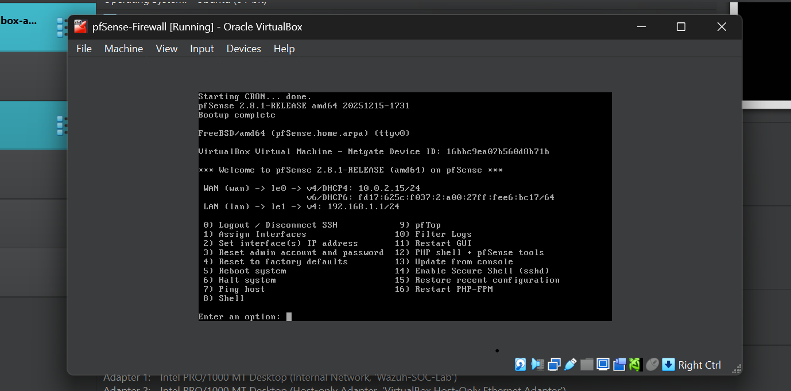
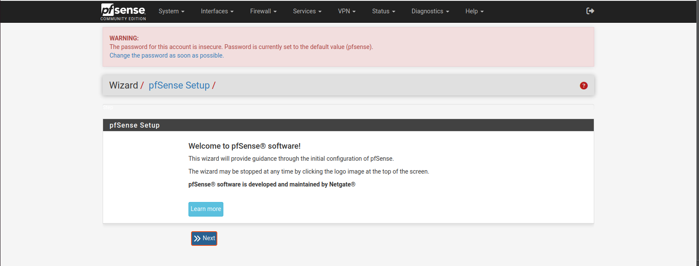
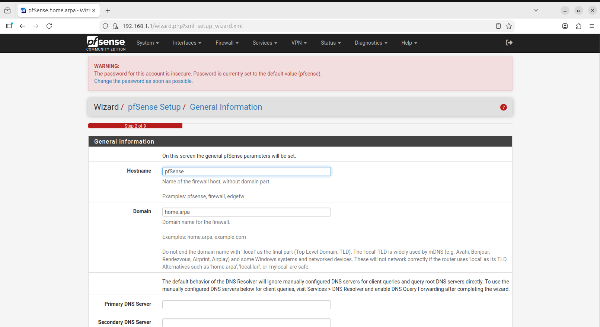

# pfSense Firewall Installation (VirtualBox)

## Overview
This document outlines the step-by-step process used to install and configure **pfSense Firewall** in **VirtualBox** as part of an enterprise SOC homelab.  
pfSense serves as the core network firewall, providing routing, traffic control, and network segmentation for other lab components such as Active Directory, Splunk, Security Onion, and Kali Linux.

---

## Prerequisites
- VirtualBox installed on host system
- pfSense ISO image downloaded
- Basic understanding of virtual networking (NAT & Internal Network)

---

## Step 1: Download pfSense ISO
1. Navigate to the official pfSense download page.
2. Download the **pfSense CE ISO Installer** (AMD64).
3. Save the ISO file locally.

---

## Step 2: Create a New Virtual Machine
1. Open **VirtualBox**.
2. Click **New**.
3. Configure the VM:
   - **Name:** pfSense-Firewall
   - **Type:** BSD
   - **Version:** FreeBSD (64-bit)
4. Assign resources:
   - **Memory:** 1–2 GB (minimum)
   - **CPU:** 1–2 cores
5. Attach pfSense ISO   
   - **Go to **Settings → Storage**.
   - Under Controller IDE, **attach the pfSense ISO file**.
   - Confirm ISO is mounted.

---

## Step 3: Configure Network Adapters
pfSense requires at least **two network interfaces** to function as a firewall.

### Adapter 1 – WAN (Internet)
- Enable Adapter
- Attached to: **NAT**
- Purpose: Provides internet access (WAN)

### Adapter 2 – LAN (Internal Network)
- Enable Adapter
- Attached to: **Internal Network**
- Name: `intnet` (or any consistent name)
- Purpose: Internal LAN for SOC lab systems

---

## Step 4: Start pfSense Installation
1. Start the pfSense VM.
2. Select **Install pfSense** when prompted.
3. Accept default options:
   - Keyboard layout
   - Partitioning (Auto / UFS)
4. Allow the installer to complete.

#### Click Accept

#### Click **OK*

#### Click **Install CE*

#### Click **OK*

#### Click **OK*

#### Click **Yes*

#### Click **OK*

#### Wait for a while, installation might take a while depending on your network speed.

### Perfect!!!! You are doing well!!!!! Let's proceed.

---

## Step 5: Reboot and Remove ISO
1. When installation completes, pfSense will prompt for a reboot.
2. **While rebooting**:
   - Power off the VM (if required)
   - Go to **Settings → Storage**
   - Remove the pfSense ISO from the virtual optical drive

⚠️ Why? This step prevents the installer from looping on reboot.

Now Click **Remove**

### Note: **after deleting the ISO file, pfSense then boots from the "pfSense Firewall.vdi below**

---

## Step 6: Initial pfSense Boot
1. Start the VM again.
2. pfSense boots into the console menu.
3. Interfaces are automatically detected:
   - **WAN** → NAT adapter
   - **LAN** → Internal Network adapter
4. Default LAN IP is typically: 192.168.1.1/24
   - **Ensure to write the IP address of the WAN and LAN somewheree, you'd need them as you proceed**

   
#### Note: **In some article, the steps might require you to setup the WAN and LAN ater starting the VM, but in this case, you've been prompted from the very start and you've selected the LAN and WAN if you could remember. **

---

## Step 7: Next, place the VMs you want to protect in the created LAN
- Click the VM and go to settings
- Go to network
- Change Adapter 1
- Attached to: **Internal Network**
- Ubuntu got an IP from pfSense
- Now pfSense and VM are on the same virtual Layer-2 network
- Firewall is ready to route traffic from the VM to the internet

#### Why this step matters
- A firewall sits between networks(WAN and LAN).
- For pfSense to protect your VM (say Ubuntu):
  - Ubuntu must send its traffic through pfSense
  - That only happens if Ubuntu’s default gateway = pfSense LAN IP.
  - And that only works if Ubuntu is on the same Layer-2 network as pfSense LAN.

- If Ubuntu was not connected to the LAN interface:
  - It would bypass the firewall.
  - pfSense would never see its traffic.
  - No filtering would happen.  

So when you placed Ubuntu in the same LAN:

> **You made pfSense the gatekeeper of Ubuntu’s traffic..**

That’s the core idea of a firewall.

---

## Step 8: Verify pfSense is Running
- pfSense console menu is accessible
- WAN interface has an IP address
- LAN interface is active
- Firewall is ready to route traffic

---

## Next Steps
- Access pfSense Web GUI from a LAN-connected VM
- Configure DHCP for internal network
- Connect other lab systems (AD, Splunk, Kali, Security Onion)
- Begin SOC monitoring and attack simulations

Voilaaaaaaaa, you are done setting up pfSense. Congratulations!!!!!!!!

---

### Further steps for me
There are more Steps for this project, the steps above are just for one LAN for the pfSense, i.e a flat network, but in this project, I would segmenting my network by creating different VLANs for the endpoints (Windows, Ubuntu), Active Directory, Splunk and Kali linux

## Step 9: Network Segmentation
- Click the VM and go to settings
- Go to network
- Adapter 1 → NAT (WAN)
- Adapter 2 → Internal_Net_Users (Windows 10, Ubuntu)
- Adapter 3 → Internal_Net_Servers (Active Directory, Splunk)
- Adapter 4 → Internal_Net_RedTeam (Kali Linux)

Each adapter becomes a separate interface in pfSense.

---

## Step 10: Placing VMs in their respective VLANs
- After the Vlans have been created, we then proceed to place VMs(ubuntu, windows etc) in their respective VLANs as needed.

---

## Lab Purpose
This pfSense installation forms the foundation of an enterprise-style SOC lab, enabling:
- Network traffic inspection
- Attack surface simulation
- Firewall logging
- Integration with SIEM and NIDS tools

---

## 👤 Author

**Olusegun Fajobi**
Cybersecurity Engineer (Blue & Red Team)
GitHub: [https://github.com/samfajobi](https://github.com/samfajobi)

