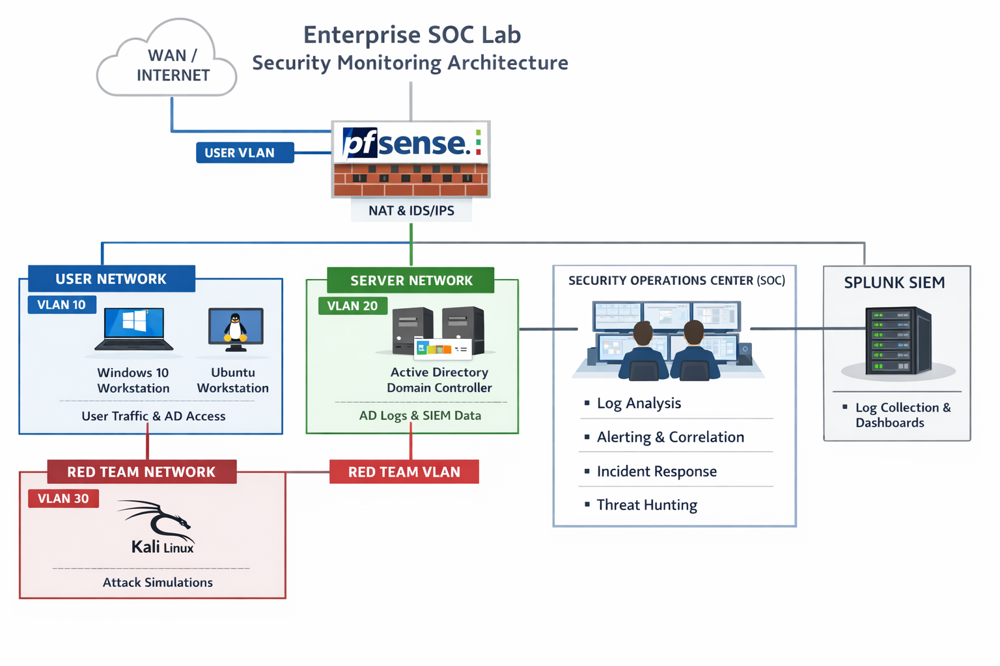

# Enterprise SOC Monitoring Project

## Overview
This project simulates a real-world **Enterprise Security Operations Center (SOC)** environment focused on centralized logging, threat detection, alerting, and incident response.

The goal of this project is to demonstrate **SOC analyst skills** such as:
- Log collection and correlation
- Detection engineering
- Incident investigation
- Security monitoring across identity, endpoint, and network layers
- Documentation and operational thinking

The environment mirrors how a small-to-medium enterprise SOC operates using industry-relevant tools and workflows.

---

## Objectives
- Build an enterprise-style SOC monitoring environment
- Collect and analyze logs from multiple security data sources
- Create meaningful detections for common attack techniques
- Simulate SOC alert → investigation → response workflows
- Document detections, incidents, and lessons learned

---

## SOC Architecture

The lab environment consists of the following components:

- **Active Directory Domain Controller**
  - Centralized identity management
  - Authentication and authorization logging

- **Windows 10 Endpoint**
  - User workstation
  - Endpoint activity monitoring

- **pfSense Firewall**
  - Network traffic inspection
  - North-south and east-west traffic visibility

- **Splunk (SIEM)**
  - Centralized log ingestion
  - Detection, alerting, and dashboards

- **Kali Linux**
  - Used to generate security-relevant events for detection validation
  - No offensive focus; used strictly for defensive simulation

All logs are forwarded and correlated within Splunk to replicate a real SOC monitoring workflow.

---

## Data Sources
This project collects and analyzes logs from the following sources:

- **Active Directory**
  - Authentication events
  - Account and group management changes
  - Privilege escalation activity

- **Windows Security Logs**
  - Process creation
  - Command-line execution
  - Persistence mechanisms

- **pfSense Firewall Logs**
  - Connection attempts
  - Port scanning behavior
  - Suspicious internal traffic patterns

---

## Detection Coverage
The SOC detections implemented in this project are grouped into three major categories:

### Identity-Based Threats
- Excessive failed logon attempts
- Password spraying indicators
- Unauthorized privilege escalation
- Suspicious administrative activity

### Endpoint-Based Threats
- Suspicious process execution
- Abnormal PowerShell usage
- Persistence mechanisms (scheduled tasks, startup entries)

### Network-Based Threats
- Port scanning activity
- Suspicious internal lateral movement
- Unusual traffic patterns

Each detection includes:
- Detection objective
- Data sources used
- Detection logic
- False positive considerations
- Severity classification
- MITRE ATT&CK mapping
- Recommended response actions

---

## Incident Response Workflow
This project simulates real SOC workflows, including:

1. Alert generation in Splunk
2. Alert validation and triage
3. Log-based investigation
4. Severity classification
5. Containment and remediation actions
6. Incident closure and documentation

Incident response playbooks are included to demonstrate structured and repeatable response procedures.

---

## Dashboards
Multiple Splunk dashboards are created to support SOC operations, including:

- SOC overview dashboard
- Identity activity dashboard
- Endpoint security dashboard
- Network traffic dashboard

Dashboards are designed for both **SOC analysts** and **security management visibility**.

---

## Threat Intelligence
Basic threat intelligence concepts are incorporated, including:

- Indicator of Compromise (IOC) management
- IP and hash matching using lookup tables
- Alert enrichment and validation
- False positive handling

---

## Capstone Incident
A full end-to-end incident simulation ties together multiple detections, demonstrating:

- Attack progression
- Alert correlation
- Timeline analysis
- MITRE ATT&CK technique mapping
- Root cause analysis
- Lessons learned

---

## Tools & Technologies
- Active Directory
- Windows 10
- pfSense Firewall
- Splunk SIEM
- Kali Linux
- MITRE ATT&CK Framework

---

## Skills Demonstrated
- Security monitoring and log analysis
- SIEM detection engineering
- SOC alert triage and investigation
- Incident response documentation
- Network and identity security fundamentals
- Enterprise SOC workflows

---

## Disclaimer
This project is for **educational and defensive security purposes only**.  
All attack simulations are performed in a controlled lab environment and are intended solely to generate security events for detection and response practice.

---

## Future Enhancements
- Expanded threat intelligence integrations
- Detection tuning and optimization
