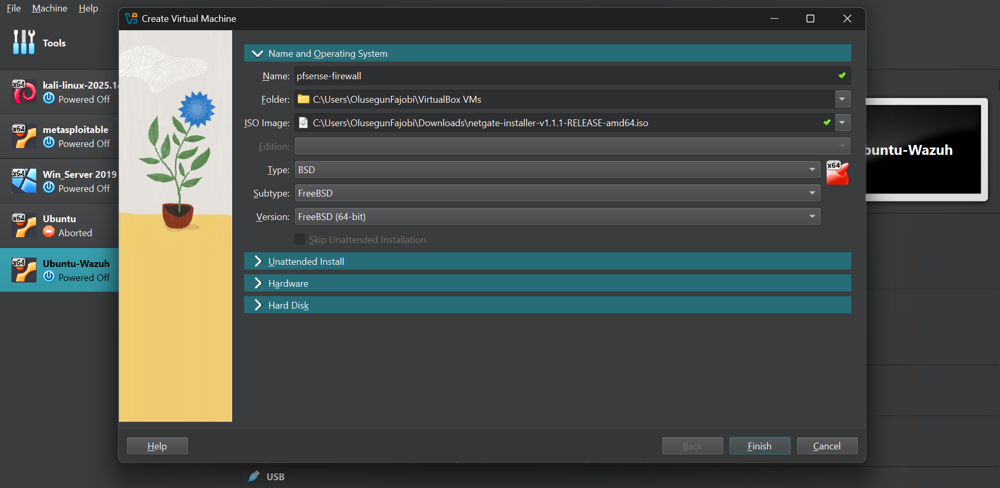

# pfSense Firewall Installation (VirtualBox)

## Overview
This document outlines the step-by-step process used to install and configure **pfSense Firewall** in **VirtualBox** as part of an enterprise SOC homelab.  
pfSense serves as the core network firewall, providing routing, traffic control, and network segmentation for other lab components such as Active Directory, Splunk, Security Onion, and Kali Linux.

---

## Prerequisites
- VirtualBox installed on host system
- pfSense ISO image downloaded
- Basic understanding of virtual networking (NAT & Internal Network)

---

## Step 1: Download pfSense ISO
1. Navigate to the official pfSense download page.
2. Download the **pfSense CE ISO Installer** (AMD64).
3. Save the ISO file locally.

---

## Step 2: Create a New Virtual Machine
1. Open **VirtualBox**.
2. Click **New**.
3. Configure the VM:
   - **Name:** pfSense-Firewall
   - **Type:** BSD
   - **Version:** FreeBSD (64-bit)
4. Assign resources:
   - **Memory:** 1–2 GB (minimum)
   - **CPU:** 1–2 cores

---