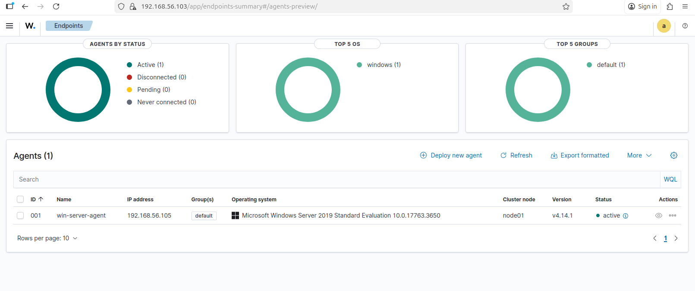

# Windows Server Enrollment into Wazuh

This document outlines the steps used to **enroll a Windows Server host into Wazuh** as part of a SOC monitoring and detection lab.
The goal is to enable **centralized log collection, endpoint visibility, and security monitoring** from Windows Server into the Wazuh manager.

---

## Prerequisites

Before enrolling the Windows Server, ensure the following:

* Wazuh Manager is installed and running
* Wazuh Dashboard is accessible
* Network connectivity exists between the Windows Server and Wazuh Manager
* Administrator privileges on the Windows Server

---

## Step 1: Create a Wazuh Agent Entry

1. Log in to the **Wazuh Dashboard**
2. Navigate to:
   **Agents → Deploy new agent**

 

3. Select:
* **Operating System:** Windows
* **Architecture:** (x64 or x86 depending on your server)


4. Copy the generated **agent installation and enrollment commands**


---

## Step 2: Install the Wazuh Agent on Windows Server

1. Log in to the Windows Server
2. Open **PowerShell as Administrator**


3. Run the provided Wazuh agent installation command, for example:

```powershell
Invoke-WebRequest -Uri https://package..........
```


*(Version may vary depending on your Wazuh release)*

---

## Step 3: Enroll the Agent with the Wazuh Manager

After installation, enroll the agent by running the enrollment command copied from the dashboard:

```powershell
"C:\Program Files (x86)\ossec-agent\agent-auth.exe" -m <WAZUH_MANAGER_IP>
```

This command registers the Windows Server with the Wazuh Manager.

---

## Step 4: Start the Wazuh Agent Service

Start and verify the agent service:

```powershell
net start wazuh
```


Confirm the service is running:

```powershell
sc query wazuh
```

---

## Step 5: Verify Agent Connection

1. Return to the **Wazuh Dashboard**
2. Navigate to:
   **Agents**
3. Confirm the Windows Server agent status shows **Active**

At this point, the Windows Server is successfully enrolled and sending logs to Wazuh.



---

## What Is Being Collected

Once enrolled, Wazuh begins collecting:

* Windows Event Logs (Security, System, Application)
* Authentication and authorization events
* System and service activity
* Endpoint security telemetry (depending on configuration)
* Custom logs (e.g., Sysmon, if enabled)

---

## Purpose in a SOC Lab

This setup enables:

* Centralized visibility of Windows Server activity
* Detection of suspicious logins and system changes
* Correlation of endpoint events with network and SIEM alerts
* Real-world SOC-style alert triage and investigation workflows

---